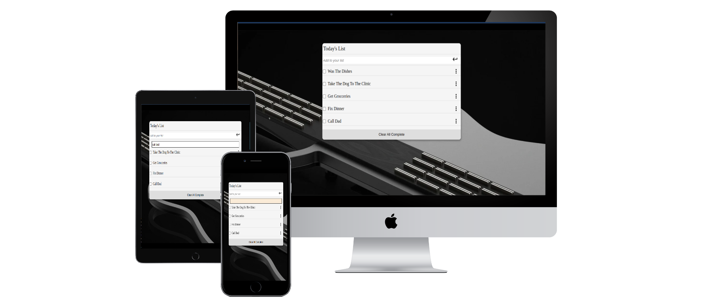
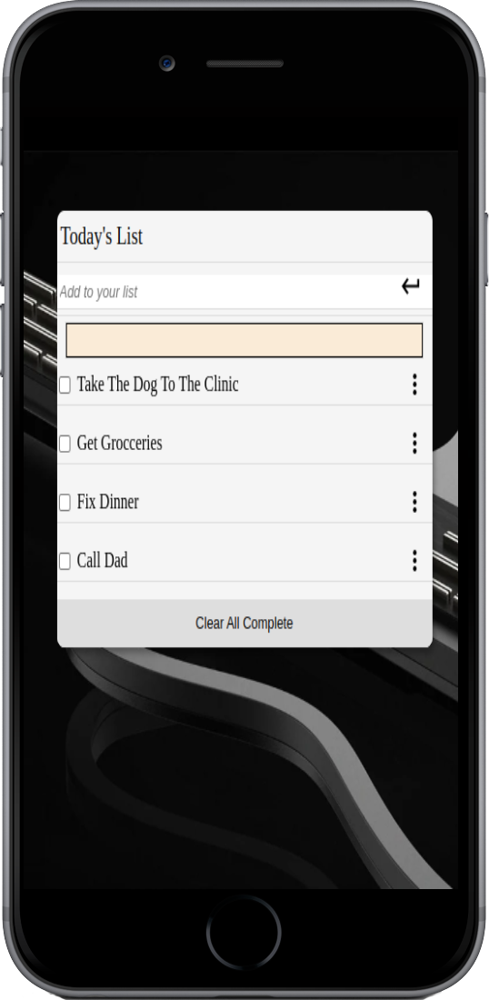

# To Do App

> This is an Educational project aimed at teaching how to give and receive professional code review. This exercise was carried out between my self and a single partner who reviewed my code base for different issues using the HTML/CSS best practices, Modern JavaScript best practices, KISS, YAGNI, and DRY guidelines.

## Live URL
[Deployment](https://acedavon.github.io/todo-list/)

## Built With

- HTML, CSS, JavaScript
- Git, GitHub, Webpack, Webpack-cli, webpack-dev-server

## Getting Started

**Setting this project Locally,**

To get a local copy up and running follow these simple example steps.

1. Clone the Repo or Download the Zip file
2. Run the live server or simply open index.html with your browser.

## Project Mockup

- All views
  

- Desktop
  .png>)

- Mobile
  

## Authors

👤 **Onate Makoji David**

- GitHub: [@aceDavon](https://github.com/acedavon)
- Twitter: [@sharkleshevon](https://twitter.com/sharkleshevon)
- LinkedIn: [Makoji david](https://linkedin.com/in/linkedinhandle)

## 🤝 Contributing

Contributions, issues, and feature requests are welcome!

Feel free to check the [issues page](../../issues/).

## Show your support

Give a ⭐️ if you like this project!

## Acknowledgments

- [Microverse](https://microverse.org)
- Inspiration
- etc

## 📝 License

This project is [MIT](./MIT.md) licensed.
